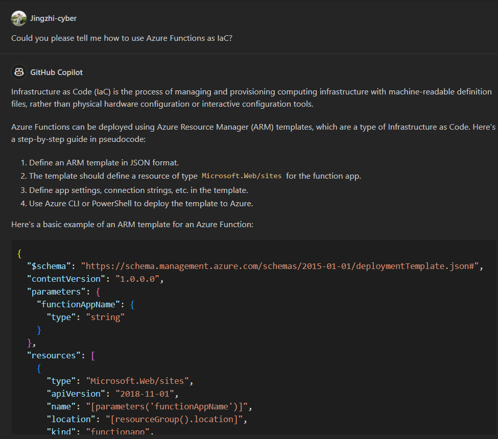

# IDS706-final-project 
[](https://github.com/nogibjj/IDS706-finalProject/actions/workflows/install.yml)
[](https://github.com/nogibjj/IDS706-finalProject/actions/workflows/lint.yml)
[](https://github.com/nogibjj/IDS706-finalProject/actions/workflows/test.yml)
[](https://github.com/nogibjj/IDS706-finalProject/actions/workflows/format.yml)

## Team Members
Bryce Shi(es474), Jingzhi Zhao(jz422), Levia Yang(hy218), Yuwen Cai(yc560)

## Demo Link
- Web Link: https://ids706-final-project.azurewebsites.net/
- Video Demo: ---- need more info ----

## Project Overview
This project develops a microservice-based Educational Metrics Service. It's designed to interface with a data pipeline, delivering detailed educational statistics about school districts. We chose Python for development, ensuring robust logging and containerization using Distroless Docker images. The service is capable of handling high-volume requests, tested to sustain 10,000 requests per second.

## Project Architecture and Structure
Our project exemplifies a Dockerized FastAPI microservice elegantly interfaced with a MySQL database, all within a robust Microsoft Azure cloud infrastructure with the Azure Functions service. Below is an overview of the project's architecture and directory structure:

### Architecture

- **Microservice**: The microservice is developed using FastAPI, a modern web framework for building APIs with Python. FastAPI is chosen for its high performance and ease of use, allowing for rapid development and a focus on standard HTTP features. The application is structured to handle a multitude of simultaneous API calls efficiently, ensuring quick response times and a high degree of concurrency.
- **Containerization with Distroless**: The FastAPI application is containerized using distroless containers, a minimalistic approach that strips down traditional container images to the bare essentials. This method removes unnecessary components like shells and package managers, reducing the surface area for security vulnerabilities. By using distroless containers, the FastAPI application is not only efficiently packaged with its required environment but also gains an enhanced level of security. This containerization approach ensures consistent performance across different environments while simplifying deployment and scaling, similar to Docker, but with an added emphasis on security and minimalism.
- **Cloud Infrastructure with Infrastructure as Code (IaC)**: The service is deployed on Microsoft Azure using Azure Functions, an event-driven, serverless computing service. This deployment is managed through Infrastructure as Code (IaC). By adopting IaC, the deployment process becomes more consistent, efficient, and error-free. Azure Functions enable the application to scale dynamically based on demand, ensuring cost-effective resource utilization. The integration of IaC with Azure Functions enhances service reliability and performance, allowing for seamless scaling and management of resources in response to varying loads, all while maintaining robust security features inherent to the Azure platform.

### Project Structure
- **CI/CD Pipeline**: Leveraging GitHub Actions for continuous integration and delivery, ensuring code quality and seamless deployment.
- **Data Interaction**: `dbquery.py` manages all interactions with the MySQL database, providing a robust layer to query and manipulate data.
- **Front-End**: `index.html` offers a user-friendly interface to interact with the service, built with Bootstrap for a responsive design.

### Workflow
- Users interact with the `index.html` page, which is served by the FastAPI application.

- Data queries are processed by FastAPI, communicating with MySQL to fetch or update data.
- GitHub Actions automate the build and push of Docker images, as well as deployment to Azure.


The architecture supports streamlined user interactions, transforming query requests into data responses through a well-orchestrated FastAPI and Azure ecosystem.

### Functions
- **HTML Interface (index.html)** 
    - Input Field: For entering a specific school district's name.
    - Buttons: To fetch information about a specific district or all districts.
    - Display Area: Shows the query results.
- **SQL Queries (dbquery.py)**
    - **Get Specific District**: Retrieves data for a given district name using a SELECT query.
    - **Get All Districts**: Fetches data for all districts with a comprehensive SELECT query.

## Key Features Overview
- **Tailored Microservice Architecture**: Our application leverages FastAPI's speed and ease of use to create efficient, asynchronous RESTful API endpoints. This design specifically supports the dynamic nature of educational data, providing a responsive and interactive user experience.
- **Optimized for High Traffic**: The service is engineered to excel under pressure, confidently supporting up to 10,000 requests per second. This capability ensures uninterrupted access to educational metrics, even during peak usage times.
- **Automated CI/CD Pipeline**: By integrating GitHub Actions, we ensure a streamlined and error-free development lifecycle. This setup automates critical steps like testing, linting, and deployment, enhancing overall code quality and operational efficiency.
- **Comprehensive Load Testing**: The application includes extensive load testing, ensuring its resilience and reliability. This thorough testing simulates high-traffic scenarios, validating the system's capability to maintain performance standards under stress.

- **Data-Driven Performance Metrics**: A core feature of our project is its commitment to quantitative assessment. We employ data science principles to monitor and report on key performance indicators such as request latency, providing a transparent view of system efficiency and stability.

## Installation and Setup
### Clone the Repository
To get started with the Educational Metrics Service, clone the repository to your local machine using the following commands in your terminal:

```bash
git clone https://github.com/nogibjj/ids706-finalProject.git
cd [ids706-finalProject]
```
### Docker Setup
- Build the docker image
```bash
docker build -t education-metrics-service .
```
- Run the container
```bash
docker run -p 8000:8000 education-metrics-service
```
### Usage
- Start the FastAPI server with Docker or manually.
- Access the web interface at http://localhost:8000.
- Use the input field to search for specific district data or click the button to fetch all districts' data.


### Dependencies

This project relies on several external libraries and tools. Ensure you have the following dependencies installed to run the project successfully.

### Backend

- **FastAPI**: A modern, fast (high-performance), web framework for building APIs with Python 3.7+ based on standard Python type hints.
- **Uvicorn**: An ASGI web server implementation for Python.
- **Pydantic**: Data validation and settings management using Python type annotations.

### Database

- **MySQL**: (Optional, if used) An open-source relational database.

### Testing

- **pytest**: A framework that makes it easy to write simple tests, yet scales to support complex functional testing.
- **requests**: A simple, yet elegant, HTTP library.

Make sure to install these dependencies before running the project. You can install them using pip:

```bash
pip install --user -r requirements.txt
```

### AI Pair Programming Tool Usage
Code Generation and Autocompletion: GitHub Copilot was used extensively for generating boilerplate code, implementing functions, and autocompleting code snippets. This significantly sped up the development process by reducing the time spent on routine coding tasks.

Code Refactoring: The tool assisted in refactoring code by suggesting cleaner, more efficient ways to structure existing code. This helped in maintaining code quality and readability.



### Limitations
- Scalability: While the current architecture is optimized for high traffic, there might be limitations in scaling vertically or horizontally, especially under unexpected surge in user requests or data volume. Exploring the system's behavior under extreme conditions could uncover potential scalability issues.
- Database Management: Using MySQL provides a robust relational database, but it may not be the most efficient choice for handling large volumes of unstructured data. Investigating NoSQL alternatives or hybrid database solutions could enhance performance.

### Potential Areas for Improvement
- Enhanced Data Analytics Capabilities: Integrating advanced data analytics and machine learning models could provide deeper insights into educational metrics, enabling predictive analytics and trend analysis.
- Improved User Interface: The current front-end is functional, but user experience can be enhanced through more interactive elements, better visualization tools, and a more intuitive design.


## Project Requirements

- Microservice
    - Build a microservice that interfaces with a data pipeline. You can choose Python or Rust for development. The microservice should include logging and be containerized using the Distroless Docker image. A Dockerfile must be included in your repository.
- Load Test
    - The microservice must be capable of handling 10,000 requests per second. A load test verifying this performance should be included.
- Data Engineering
    - Your project should involve the use of a library specializing in data engineering such as Spark, Pandas, SQL, a vector database, or any other relevant library.
- Infrastructure as Code (IaC)
    - Your project must utilize an IaC solution for infrastructure setup and management. You can choose among AWS CloudFormation, AWS SAM, AWS CDK, or the Serverless Framework.
- Continuous Integration and Continuous Delivery (CI/CD)
    - Implement a CI/CD pipeline for your project. It could be through GitHub Actions or AWS Cloud Build or any other relevant tool.
- README.md
    - A comprehensive README file that clearly explains what the project does, its dependencies, how to run the program, its limitations, potential areas for improvement, and how AI Pair Programming tools (GitHub Copilot and one more tool of your choice) were used in your development process.
- Architectural Diagram
    - A clear diagram representing the architecture of your application should be included in your project documentation.
- GitHub Configurations
    - Your GitHub repository must include GitHub Actions and a .devcontainer configuration for GitHub Codespaces. This should make the local version of your project completely reproducible. The repository should also include GitHub Action build badges for install, lint, test, and format actions.
- Teamwork Reflection
    - Each team member should submit a separate 1-2 page management report reflecting on the team's functioning according to the principles discussed in your teamwork book. This report should not be part of the GitHub README but rather a separate document. It should include a peer evaluation in which each team member is graded on their performance, stating three positive attributes and three areas for improvement as the basis for the grade. Note that each student will share the teamwork reflection with their team and discuss it in a session before turning in the report. The outcome of this feedback session must be included in the report for full credit.
- Quantitative Assessment
    - The project must include a quantitative assessment of its reliability and stability. You must use data science fundamentals to describe system performance, e.g., average latency per request at different levels of requests per second (100, 1000, etc.). Think of the software system as a data science problem that needs to be described using data science principles.
- Demo Video
    - A YouTube link in README.md showing a clear, concise walkthrough and demonstration of your application, including the load test and system performance assessment.
- Team Size and Makeup
    - The team should consist of 3-4 people, ideally composed of 1-2 strong programmers and 1-2 quantitative storytellers.


## Grading Rubric

- Microservice (20%)
    - Implementation of the microservice: 10 points
    - Use of logging: 5 points
    - Proper containerization with Distroless: 5 points
- Load Test (20%)
    - Successful load test at 10,000 requests/second: 20 points
- Data Engineering (10%)
    - Effective use of a data engineering library: 10 points
- Infrastructure as Code (IaC) (10%)
    - Correct setup and management of infrastructure using IaC: 10 points
- Continuous Integration and Continuous Delivery (CI/CD) (10%)
    - Proper implementation of a CI/CD pipeline: 10 points
- README.md (10%)
    - Clarity and comprehensiveness of README.md: 5 points
    - Explanation of AI Pair Programming tool usage: 5 points
- Architectural Diagram (5%)
    - Quality and clarity of the architectural diagram: 5 points
- GitHub Configurations (5%)
    - GitHub Actions + GitHub Codespaces .devcontainer configuration: 5 points
- Final Team Presentation (15%)
    - Quality and clarity of presentation: 10 points
    - Team's ability to effectively answer questions and discuss the project: 5 points
- Teamwork Reflection (5%)
    - Quality and sincerity of reflection: 3 points
    - Reflection includes peer evaluation with three positive attributes and three areas for improvement: 2 points
- Total: 100%
